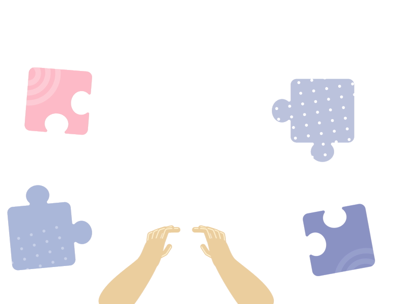
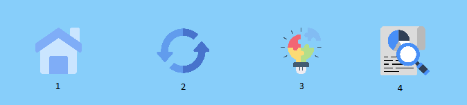

    <h1>EIACD | Klotski Game [Python]</h1>

    

    

 

    
    
    
    

## Introdução
O **Klotski** trata-se de um jogo de quebra-cabeças que envolve mover uma ou mais peças num tabuleiro (5x4) de forma a alcançar um objetivo. Neste jogo, o objetivo é mover a **peça vermelha** ao longo do tabuleiro até alcançar a sua posição final. As peças podem apresentar tanto um formato como um tamanho variáveis, dispondo, assim, de  imensas **configurações** possíveis para o tabuleiro.

Por fim, este jogo dispõe de vários **níveis de dificuldade** de forma a estimular o jogador e simultaneamente proporcionar uma experiência mais desafiante.

## Pré-Requisitos
De forma a compilar e executar o programa são necessários vários pré-requiitos:
- **[Python & Pip](#python-e-pip)**
- **[Instalação de Bibliotecas](#instalação-de-bibliotecas)**

### Python e Pip 

Caso não tenha o Python 3 ou o Gestor de Pacotes pip instalados, pode fazê-lo [em **Ubuntu**] através do comando:

    sudo apt-get install python3 python3-pip

### Instalação de Bibliotecas

Por sua vez, deve certificar-se que tem instalado as bibliotecas necessárias (**[Pygame](https://www.pygame.org/wiki/GettingStarted)**). Para tal basta executar:

    pip install -r requirements.txt

## Compilação e Execução
Assim, de forma a compilar e executar o programa, basta executar o seguinte **comando** no seu terminal:

    python Game.py
    
Caso não funcione, verifique que possui todos os pré-requisitos mencionados **[anteriormente](#pré-requisitos)** e tente novamente. 
Se o problema persistir não hesite em **[contactar-nos](#considerações-finais)**.

## Interface Gráfica
A Implementação (em Python) do **Jogo *Klotski*** elaborada dispõe de uma Interface Gráfica.
Nesta existem vários menus, níveis e configurações modificáveis atendendo às necessidades e interesse do utilizador.

 <video src= "https://github.com/EstevesX10/EIACD-Klotski/assets/103591462/208d3d9d-8520-427e-97fc-c61f8ea90b62" />

## Menus
Existem **3 Menus**:
- ***Main Menu*** (Ecrã Inicial do Jogo)
- ***Modes Menu*** (Permite a escolha entre duas dificuldades de Níveis: ***Easy*** e ***Hard***)
- ***Options Menu*** (Contém informações sobre o jogo e de possíveis alterações dos algoritmos a testar)

## Níveis
Os Níveís para além de poderem ser resolvidos por parte do utilizador, estes apresentam outras funcionalidades:
- Regressar à escolha de nível através do butão ***Home*** (**botão 1**).
- Dar ***reset*** ao nível (isto é, voltar à configuração inicial do nível) pressionado o respetivo botão (**botão 2**).
- Resolução do Nível com recurso a um Algoritmo de Pesquisa (__*A** Algorithm__) através do **botão 3**.
- Visualizar a **Eficiência** de vários Algoritmos de Pesquisa (através do **tempo**, **quantidade de nós explorados** e de **passos até alcançar a solução**) na resolução do nível atual. Para tal, bastará pressionar o **botão 4**.

 

    

# Considerações Finais

Se existir alguma **dificuldade** no download ou execução da aplicação não hesite em contactar-nos:
- **Via email**: 
    - [Gonçalo Esteves](https://github.com/EstevesX10) - `up202203947@up.pt`
    - [Mariana Gomes](Insert_Github_Link) - `up202206615@up.pt`
